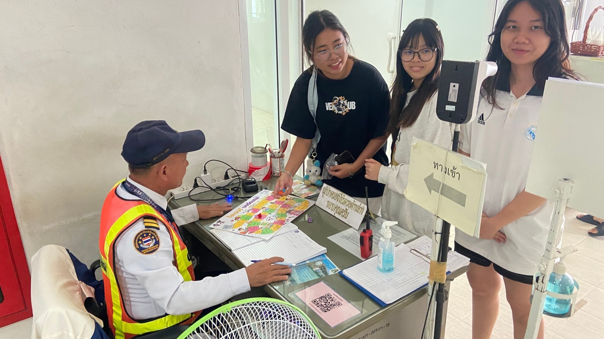
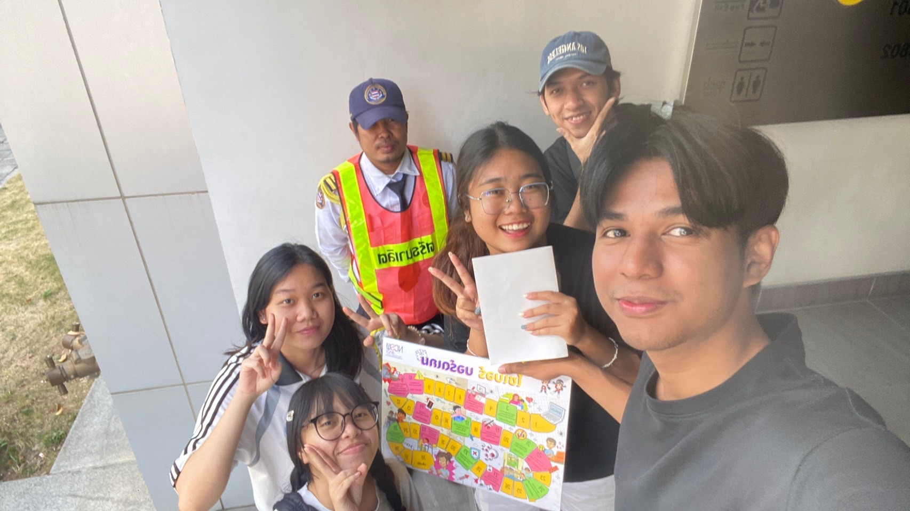
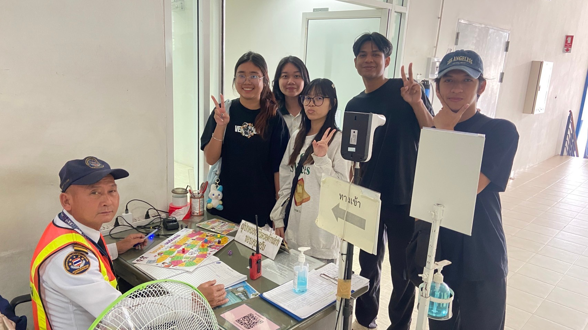
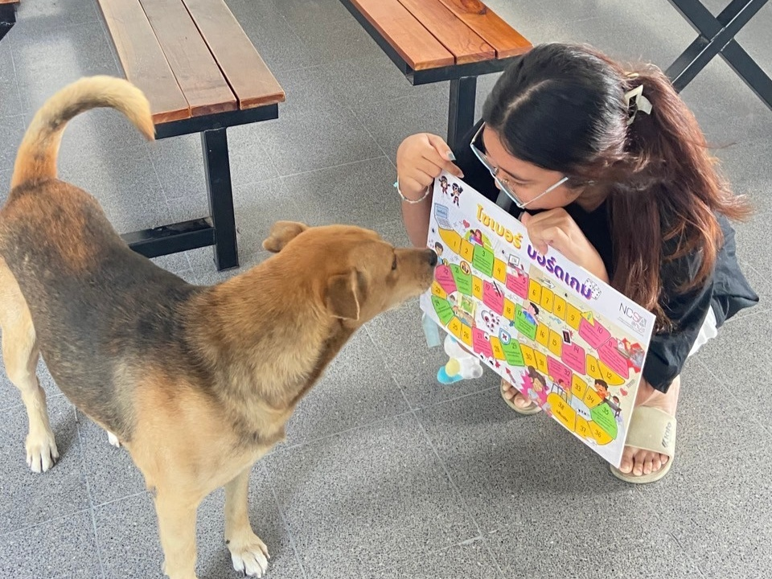

# 🛡️ Cyber Board Game – เล่นสนุก ป้องกันไซเบอร์ได้! 🚔🎲 

---
## 🎲 เล่นบอร์ดเกม สนุก แถมได้รู้จัก Cybersecurity! 🛡️💻

ใครว่าเรื่อง **Cybersecurity (ความปลอดภัยไซเบอร์)** เป็นเรื่องยาก?  
แค่เล่น **บอร์ดเกมไซเบอร์** ก็เรียนรู้ได้ง่ายๆ แถมสนุกสุดๆ ด้วย! 😆🎉 

## 🎉 รายละเอียดกิจกรรม  

📅 **วันที่:** 19 มกราคม 2568  
⏰ **เวลา:** 15.00 น.  
📍 **สถานที่:** ตึกพาณิชย์นาวี  
🎯 **กลุ่มเป้าหมาย:** พี่ยามสุดแกร่งแห่งตึกต่างๆ

---

## 💡 ทำไมถึงต้องเล่นเกมนี้?  
✅ **เรียนรู้ Cybersecurity แบบไม่เครียด**  
✅ **ฝึกคิดไวและรับมือกับภัยออนไลน์**  
✅ **เล่นได้ทั้งกับเพื่อนและครอบครัว สนุกไปด้วยกัน!**

---

## 🎯 วิธีการเล่นแบบง่ายๆ  

### 1️⃣ ใครได้เริ่มก่อน? 🐰  
- ทุกคนต้อง **ทอยลูกเต๋า** เพื่อวัดดวง! 🎲  
- ใครได้แต้มสูงสุด **เริ่มเดินเกมก่อน**  
- จากนั้นเรียงลำดับผู้เล่นตามคะแนนที่ได้  

---

### 2️⃣ เดินหน้าไปสู่ชัยชนะ! 🏃‍♂️💨  
- เดินตามจำนวนแต้มที่ทอยได้  
- **แต่ระวัง!** บนกระดานมีช่องพิเศษซ่อนอยู่  
  - บางช่องจะท้าทาย **ทักษะป้องกันไซเบอร์ของคุณ**  
  - บางช่องอาจเป็นกับดักที่ทำให้คุณเสียเปรียบ  
  - และบางช่อง… อาจให้โอกาสคุณพลิกเกม! 🎮

---

### 3️⃣ ใครจะเป็นสุดยอดนักป้องกันไซเบอร์? 🏆  
- **เป้าหมายของคุณ:** กลายเป็น **"แชมป์ไซเบอร์"** ที่สามารถเอาชนะภัยคุกคามได้  
- คนที่สามารถผ่านอุปสรรคทั้งหมดและเข้าเส้นชัยก่อน **จะเป็นผู้ชนะ!**  
- และอย่าลืมว่า… **คนที่มีทักษะป้องกันระบบดีที่สุดจะได้รับรางวัลพิเศษ!** 🎉

---
{: .message-box}
# 🛡️ ทีม **HABUNG** 🚀  

> **"รวมพลังปกป้องโลกไซเบอร์! สนุก เรียนรู้ และปลอดภัยไปด้วยกัน"** 🔐💡  
มารู้จักกับสมาชิกแต่ละคนกันเลย 🎉  

## 🌟 **สมาชิกในทีม** 🌟  

| ** 👤 ชื่อสมาชิก **                | ** 🔗 ลิงก์ GitHub **              |
|-------------------------------|-------------------------------|
| 🎮 **Panumas Chathaisong**     | [GitHub](https://panumastt1.github.io/boardgame)                   |
| 🎨 **Manitchaya Benjajuedsiri** | [GitHub](https://manitchaya2004.github.io/boardgame)                   |
| 🛠️ **Teerakorn Tangwattanakit** | [GitHub](#)                   |
| 🔍 **Addeen Salahsakul**       | [GitHub](https://itzdeenzxx.github.io/boardgame)                   |

💡 *(สามารถคลิกที่ GitHub เพื่อไปดูของแต่ละคนได้เลย!)*  

---

## 🎯 **เป้าหมายของเรา**  
✅ พัฒนา **Cyber Board Game** ให้เข้าใจง่าย สนุก และให้ความรู้  
✅ สร้างการตระหนักรู้เกี่ยวกับ **ภัยไซเบอร์** ในรูปแบบที่เข้าถึงได้  
✅ ผลักดันแนวคิด **"เล่นไป เรียนไป ป้องกันภัยไซเบอร์ไปด้วย!"**

---

## 🎲💡 ส่งต่อความรู้ดีๆ กับบอร์ดเกม Cyber! 🚀✨  

นอกจากที่พวกเรากลุ่ม **Habung** จะได้สนุกไปกับการเรียนรู้เรื่อง **Cybersecurity** ผ่านบอร์ดเกมแล้ว  
พวกเรายังได้ **ส่งต่อความสนุกนี้ไปยังกลุ่ม "เสกสรรสาและสกุล" อีกด้วย!** 🎁🎉  

> **เพราะความรู้ดีๆ ไม่ควรหยุดแค่ที่เรา!**  
> การเล่นบอร์ดเกมนี้ช่วยให้ทุกคนได้ **เข้าใจเรื่องความปลอดภัยไซเบอร์**  
> และยังทำให้การเรียนรู้เป็นเรื่อง **ง่าย สนุก และไม่น่าเบื่อ!** 🥳  

✨ **จากพวกเรา ถึงพวกคุณ!** ✨  
เราหวังว่ากลุ่ม **เสกสรรสาและสกุล** จะได้ **สนุกและได้รับความรู้ไปพร้อมๆ กัน**  
แล้วอย่าลืมส่งต่อความรู้ดีๆ นี้ไปให้คนอื่นด้วยน้า~ 💖  

💬 **#แชร์ความรู้ #Cyberสนุกได้ #BoardGameเพื่อความปลอดภัย**

---

# หากใครยังไม่รู้จัก Cyber Security มาทางนี้ 👋🏻🙀  
## 🌐 Cyber คืออะไรน้า~? 💻✨  

Cyber (ไซเบอร์) ก็คือ **"โลกออนไลน์"** หรือ **"โลกดิจิทัล"** ที่เราท่องไปทุกวัน!  
ไม่ว่าจะเป็น...  
✅ เล่นโซเชียล 📱  
✅ ดูยูทูป 🎥  
✅ สั่งของออนไลน์ 🛒  
✅ แชทกับเพื่อน 💬  

ทุกสิ่งที่เกิดขึ้นบนอินเทอร์เน็ต ล้วนเป็นส่วนหนึ่งของ **Cyber** 💡  

---

## 🏙️ ลองจินตนาการว่า Cyber เป็นเหมือนเมืองมหัศจรรย์! 🏙️  
ในเมืองนี้มีทั้ง...  
🔹 ข้อมูล 📄  
🔹 ข่าวสาร 📰  
🔹 ผู้คนมากมาย 🏃‍♂️🏃‍♀️  

แต่! เมืองนี้ก็มีอันตรายซ่อนอยู่ 😱  
🚨 **โจรไซเบอร์ (แฮกเกอร์)** แอบขโมยข้อมูล  
🚨 **กับดักฟิชชิ่งลิงก์** หลอกให้คลิกลิงก์ปลอม  
🚨 **ไวรัสและมัลแวร์** ที่ทำให้อุปกรณ์พัง  

---

## 🛡️ Cybersecurity คืออะไร? 🤖  
Cybersecurity หรือ **ความปลอดภัยไซเบอร์** ก็คือ...  
> **เกราะป้องกันตัวเองในโลกออนไลน์!**  

✨ ช่วยให้เรา...  
✅ **ไม่โดนแฮก** ข้อมูลส่วนตัว  
✅ **ไม่โดนไวรัส** หรือมัลแวร์  
✅ **เล่นอินเทอร์เน็ตได้แบบปลอดภัย** 🛡️  

ถ้ารู้จัก Cybersecurity ก็เหมือนพกโล่และดาบคู่ใจ ⚔️  
ทำให้เราท่องโลกไซเบอร์ได้แบบ **สบายใจ ไม่มีใครมาหลอกเราได้!** 🎉  

---

## 🔥 เคล็ดลับ Cybersecurity ง่ายๆ ที่ควรรู้ 🔥  
💡 **ใช้รหัสผ่านที่แข็งแรง** (ยากต่อการเดา)  
💡 **เปิดใช้ 2FA (Two-Factor Authentication)**  
💡 **อย่ากดลิงก์แปลกๆ ที่ไม่น่าไว้ใจ**  
💡 **อัปเดตซอฟต์แวร์และแอปเสมอ**  
💡 **อย่าแชร์ข้อมูลส่วนตัวมั่วๆ ในโซเชียล**  

**แค่ปฏิบัติตามนี้ ก็ช่วยให้เราเซฟตัวเองจากภัยไซเบอร์ได้แล้ว!** 🚀  

---

✨ **ท่องโลก Cyber ให้สนุก และปลอดภัยกันนะ!** ✨  
🌍💖 #StaySafeOnline #CyberSecurity #ProtectYourData  
