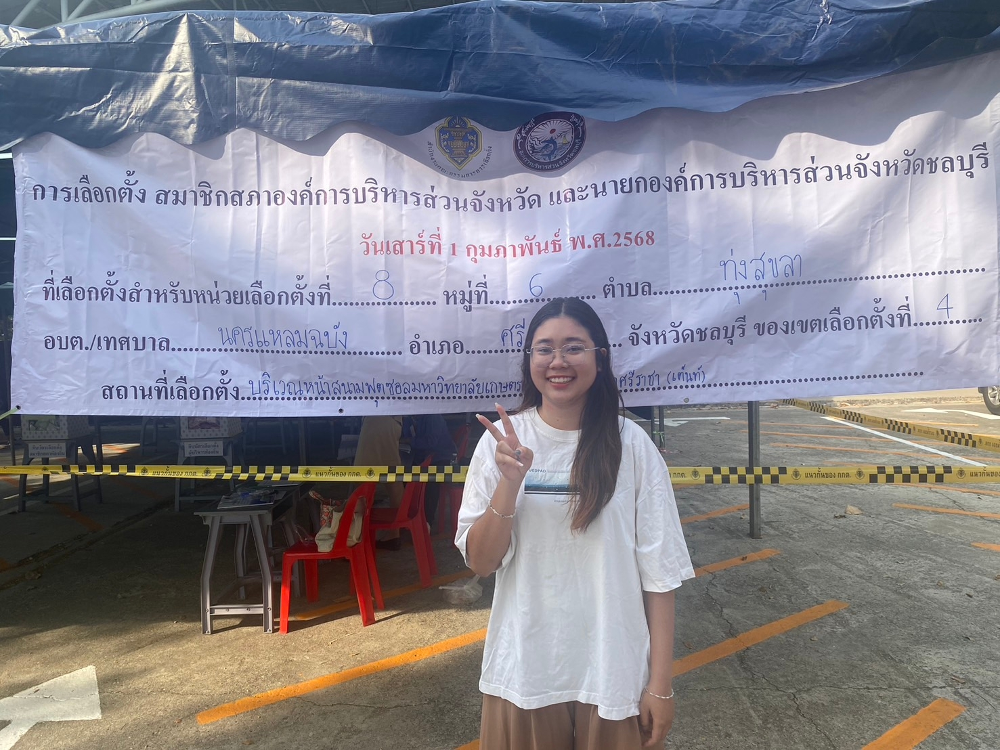

# 🗳️ PAO Elections 2025  

การเลือกตั้ง **สมาชิกสภาองค์กรบริหารส่วนจังหวัด** และ **นายกองค์การบริหารส่วนจังหวัดชลบุรี**  

📅 **วันที่:** 1 กุมภาพันธ์ 2568  

---

## ✅ **Check-in**  
  

---

## 📍 **รายละเอียดสถานที่**  
> 🏛️ **สถานที่เลือกตั้ง:**  
> เขตเลือกตั้งที่ 8, หมู่ที่ 6 
> ตำบล: **ทุ่งสุขลา**  
> อำเภอ: **ศรีราชา**  
> จังหวัด: **ชลบุรี**  

  

---

## 📌 **ขั้นตอนการเลือกตั้ง**  
1. **ตรวจสอบรายชื่อ** ที่จุดลงทะเบียน  
2. **รับบัตรเลือกตั้ง** จากเจ้าหน้าที่  
3. **เข้าคูหาเลือกตั้ง** และกาเลือกผู้สมัคร  
4. **หย่อนบัตรลงหีบเลือกตั้ง**  
5. **ตรวจสอบความถูกต้องก่อนออกจากหน่วยเลือกตั้ง**  

---

## 📷 **Gallery**  
  
  

---

## 📜 **หมายเหตุ**  
- **เนื่องจากหนูอยู่ในพื้นที่ของกรุงเทพมหานคร** จึงมาถ่ายรูปเพื่อเป็นการ check in ✔️ เพื่อใช้เป็นรูปภาพประกอบในการส่งงานรายวิชา Information System Security ค่ะ✨

---

**🔗 แหล่งข้อมูลเพิ่มเติม:** [เว็บไซต์ กกต.](https://www.ect.go.th/)  
